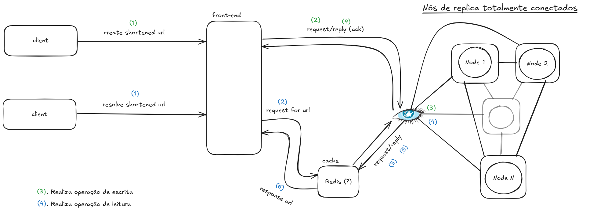

## Sumário

 - [Sobre](#sobre)
 - [Arquitetura do Sistema](#arquitetura-do-sistema)
 - [Tecnologias utilizadas](#tecnologias)
 - [Como executar](#como-executar)
 - [Exemplo](#exemplo)
 - [Ajuda e Contribuições](#mantenedores-e-contribuições)

## Sobre

Este projeto é uma implementação de um **encurtador de URLs distribuído**.

A aplicação permite que os usuários transformem URLs longas e complexas em links curtos e fáceis de compartilhar. A motivação desse projeto é explorar tecnologias e aplicar conceitos de sistemas distribuídos em uma aplicação prática --- desenvolvido para a disciplina de Sistemas Distribuídos (2025/1) do Bacharelado em Ciência da Computação da UTFPR-CM.

  

As duas operações fundamentais da aplicação são:

1. **Encurtar uma URL**: Um cliente envia uma URL longa e o servidor retorna uma versão curta e única.

2. **Resolver uma URL**: Quando um cliente acessa a URL encurtada, o servidor o redireciona para a URL original correspondente.

A especificação da **interface de serviço** da aplicação foi realizada utilizando o *Swagger*. Para acessá-la, [execute o servidor](#como-executar) e acesse o caminho `/api-docs`.

## Arquitetura do Sistema

A Figura a seguir apresenta a arquitetura do sistema.

O fluxo das operações é representado pela enumeração das etapas de processamento. Os rótulos verdes e azuis representam, respectivamente, as operações *Encurtar uma URL* e *Resolver uma URL*.

  



  

**Errata** sobre a Figura: faltam as etapas de retorno para o cliente (*front-end* -> *client*).

  

## Tecnologias

 - **Swagger**: Utilizado para especificar a interface de serviço.
 - **CassandraDB**: SGBD distribuído utilizado para armazenar as URLs encurtadas de forma escalável.
 - **Redis**: Utilizado como cache para acelerar a resolução das URLs curtas.
 - **Node.JS**/**Express**: Ambiente e *framework* utilizados para a construção da aplicação web.

## Como Executar

1. Certifique-se que possui **TODAS** as ferramentas necessárias:  
		- [docker/docker-compose](https://docs.docker.com/compose/install/);  
		- [Node.JS](https://nodejs.org/en/download). (<small>testado somente com >=v18.20.4</small>)  
  
2. Clone o repositório:
	```bash
	git clone https://github.com/atenokida/distributed-url-shortener.git
	```

3. Instale as dependências:
	```bash
	npm install
	```

4. Crie e execute os contêineres dos serviços *CassandraDB* e *Redis*:
	```bash
	docker-compose up -d
	# Após a finalização da execução, aguarde alguns segundos (~15s)
	# e verifique o status.
	docker ps --filter name=cassandra1 --filter name=cassandra2 --filter name=cassandra3 --filter name=redis
	# O resultado do comando acima deve exibir quatro contêineres em execução.
	```

5. Crie o arquivo ``.env`` na raíz do projeto e configure as variáveis de ambiente de acordo com seu ambiente. Todas as variáveis obrigatórias podem ser encontradas no arquivo [``.env.example``](https://github.com/atenokida/distributed-url-shortener/blob/main/.env.example).
   
6. Verifique a versão do CQL spec:
	```bash
	docker exec -it cassandra1 cqlsh cassandra1
	cqlsh> show version
	```
	A versão geralmente é exibida na terceira coluna.

7. Execute o contêiner para criar a tabela necessária (obrigatório somente na primeira execução).
	```bash
	# PS: Execute o comando na raíz do projeto.
	docker run --rm --network distributed-url-shortener_cassandra-net -v "$(pwd)/init.cql:/scripts/data.cql" -e CQLSH_HOST=cassandra1 -e CQLSH_PORT=9042 -e CQLVERSION=<sua-versão-obtida-no-passo-6> nuvo/docker-cqlsh
	```
8. Execute o servidor:
	```bash
	npm start
	```
## Exemplo
### Criando uma URL encurtada
Faça uma requisição ``POST`` no caminho ``url`` do serviço. O ``body`` (payload) deve estar em JSON e conter o atributo "url", que representa a URL a ser encurtada.
Exemplo:
```JSON
{ 
	"url": "https://www.google.com/search?q=sistemas+operacionais",
	"alias": "busca-sistemas-operacionais"
}
```
Um exemplo de resposta seria:
```JSON
{
	"short_url": "http://<your_server_listening_location>/ux2TSfllX",
	"short_code": "ux2TSfllX",
	"alias": "busca-sistemas-operacionais",
	"long_url": "https://www.google.com/search?q=sistemas+operacionais",
	"created_at": "2025-07-05T13:52:17.143Z"
}
```

### Resolvendo uma URL encurtada
Faça uma requisição ``GET`` seguindo o formato: ``http://<your_server_listening_location>/<short_code>``.
Caso não haja falhas no processamento da requisição, você deve ser redirecionado para a URL original.

## Mantenedores e Contribuições
Este projeto é mantido por [atenokida](https://github.com/atenokida). O projeto não está aberto para contribuições externas. No entanto, sinta-se confortável para reportar problemas por meio de *[issues](https://github.com/atenokida/distributed-url-shortener/issues/new)*.